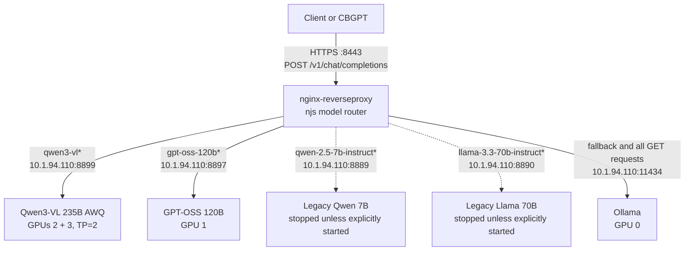

# CBQ2 DEV LLM Gateway Operations Runbook

**Host:** `cbq2-svd-dsgpu2` (`10.1.94.110`)  
**Runtime:** rootless Podman operated by `srv_mlengineering`  
**Primary configuration directory:** `/apps/srv_mlengineering/nim`  
**Last updated:** 1 September 2026  
**Classification:** Internal infrastructure information. Do not publish externally.

---

## 1. Purpose

This document is the operating and change-management guide for the model-serving gateway on `cbq2-svd-dsgpu2`. It is written so that a human engineer or a future AI agent can:

1. Understand what is running and why.
2. Identify the authoritative configuration files.
3. Connect a model to the HTTPS Nginx gateway.
4. Add or remove Compose dependencies safely.
5. preserve the intended GPU allocation.
6. Change model context, concurrency, or tool-calling settings.
7. Validate a change before disrupting traffic.
8. Diagnose Nginx `502`, model startup, DNS, bind-mount, GPU, or parser failures.
9. Roll back without deleting model weights or unrelated containers.

This host is labelled DEV, but it serves live-looking workloads and approximately twenty containers use `-prod` names. Treat every model or gateway restart as production-impacting.

---

## 2. Critical operating rules

Read these rules before changing anything.

### 2.1 Never use broad or destructive Podman commands

Do not run:

```bash
podman stop -a
podman rm -a
podman system prune -a
podman volume prune
podman system reset
```

The account and container storage are shared. These commands can stop or destroy other teams' services and caches.

### 2.2 Never use `--gpus all`

Assign explicit CDI devices:

```yaml
devices:
  - "nvidia.com/gpu=2"
  - "nvidia.com/gpu=3"
```

Using all GPUs can let a model occupy GPU 0 or GPU 1 and interfere with embeddings, GPT-OSS, or other services.

### 2.3 Always include the SELinux exception used on this host

Every GPU model service requires:

```yaml
security_opt:
  - "label=disable"
```

Without it, containers have previously failed with errors such as:

```text
libc.so.6: cannot change memory protections
```

### 2.4 Do not use `sed -i` on a file already bind-mounted into a running container

`sed -i` normally writes a new inode and renames it over the original path. A running container can remain attached to the old inode and continue seeing stale content.

This has already happened with the Nginx configuration: the host file showed `10.1.94.110:8889`, while the container still saw `nim-qwen7b:8000`.

For a bind-mounted file, either:

- edit it using an in-place `r+` write that preserves its inode; or
- recreate the container after editing so the bind mount is established again.

It is safe to use `sed -i` on the Compose YAML itself because that file is read by Compose and is not the Nginx configuration bind mount.

### 2.5 Never reload Nginx unless its configuration passes validation

Always run:

```bash
podman exec nginx-reverseproxy nginx -t
```

Only after both `syntax is ok` and `test is successful` may Nginx be reloaded:

```bash
podman exec nginx-reverseproxy nginx -s reload
```

### 2.6 `depends_on` is not routing

Compose `depends_on` controls startup ordering. It does not tell Nginx where a model is, does not rewrite the API's `model` field, and does not make a backend healthy.

Routing requires all three of the following:

1. A reachable model API endpoint.
2. An Nginx `upstream` and named `location`.
3. An njs branch that maps the JSON `model` value to that named location.

### 2.7 A full Compose `up` starts all ordinary services

This command starts every service in the file, including legacy Qwen 7B and Llama 70B services:

```bash
podman-compose -f /apps/srv_mlengineering/nim/docker-compose-extended.yml up -d
```

When only the gateway and its configured dependencies should be started, use:

```bash
podman-compose -f /apps/srv_mlengineering/nim/docker-compose-extended.yml up -d nginx
```

When only one model should be recreated, name that model and use `--no-deps`:

```bash
podman-compose -f /apps/srv_mlengineering/nim/docker-compose-extended.yml \
  up -d --no-deps --force-recreate nim-qwen3vl
```

---

## 3. Target architecture



### 3.1 Intended GPU allocation

| Host GPU | Profile | Intended workload |
|---:|---|---|
| 0 | H200-141C, 144,384 MiB | Embeddings, Ollama, reranker, supporting workloads |
| 1 | H200-141C, 144,384 MiB | `nim-gptoss120b` |
| 2 | H200-141C, 144,384 MiB | `nim-qwen3vl`, tensor-parallel rank |
| 3 | H200-141C, 144,384 MiB | `nim-qwen3vl`, tensor-parallel rank |

Qwen 7B was previously assigned GPU 2 and Llama 70B GPU 3. They must not be started while Qwen3-VL 235B owns GPUs 2 and 3.

### 3.2 Model endpoint map

| Compose service | Container | Host port | Served model ID | Normal state |
|---|---|---:|---|---|
| `nim-qwen3vl` | `nim-qwen3vl` | 8899 | `qwen3-vl-235b-awq` | Running |
| `nim-gptoss120b` | `nim-gptoss120b` | 8897 | `openai/gpt-oss-120b` | Running |
| `nim-qwen7b` | `nim-qwen7b` | 8889 | `qwen/qwen-2.5-7b-instruct` | Stopped while Qwen3-VL is active |
| `nim-llama70b` | `nim-llama70b` | 8890 | `meta/llama-3.3-70b-instruct` | Stopped while Qwen3-VL is active |
| `ollama-node-1` | `ollama1` | 11434 | Multiple Ollama model IDs | Running as required |

The model IDs must be obtained from each backend's `/v1/models` response and used exactly in client requests. The Nginx router matches substrings, but the backend may reject an alias that is not one of its served model IDs.

---

## 4. Authoritative files

| Purpose | Host path | Container path |
|---|---|---|
| Compose services and dependencies | `/apps/srv_mlengineering/nim/docker-compose-extended.yml` | Not mounted; read by `podman-compose` |
| Nginx configuration | `/apps/srv_mlengineering/nim/nginx/nginx_router_hybrid_extended.conf` | `/etc/nginx/nginx.conf` |
| njs model router | `/apps/srv_mlengineering/nim/nginx/router_hybrid_extended.js` | `/etc/nginx/router.js` |
| Nginx logs | `/apps/srv_mlengineering/nim/docker_logs/nginx/logs` | `/var/log/nginx` |
| Qwen model weights | `/apps/srv_mlengineering/model-staging/qwen3-vl-235b-awq` | `/opt/nim/models/qwen3-vl` |
| Shared NIM cache | `/apps/srv_mlengineering/nim-cache` | `/opt/nim/.cache/ngc` |

Treat the host files as authoritative. After editing a bind-mounted file, confirm that the running container sees the same content.

### 4.1 Verify the bindings

```bash
podman inspect nginx-reverseproxy \
  --format '{{range .Mounts}}{{println .Source "->" .Destination "RW=" .RW}}{{end}}'
```

Compare the relevant Nginx lines on the host and in the container:

```bash
grep -nE 'backend_qwen|backend_llama|backend_gptoss|8889|8890|8897|8899' \
  /apps/srv_mlengineering/nim/nginx/nginx_router_hybrid_extended.conf
```

```bash
podman exec nginx-reverseproxy \
  grep -nE 'backend_qwen|backend_llama|backend_gptoss|8889|8890|8897|8899' \
  /etc/nginx/nginx.conf
```

If the outputs differ, do not reload the stale configuration. Recreate only Nginx:

```bash
podman-compose -f /apps/srv_mlengineering/nim/docker-compose-extended.yml \
  up -d --no-deps --force-recreate nginx
```

Then validate again.

---

## 5. Compose configuration

### 5.1 Service keys versus container names

Compose `depends_on` uses the service key under `services:`, not an arbitrary container name.

Example:

```yaml
services:
  nim-qwen3vl:                 # Compose service key
    container_name: nim-qwen3vl
```

The service key and container name happen to be identical here, but future agents must verify rather than assume this.

List the Compose service keys:

```bash
podman-compose \
  -f /apps/srv_mlengineering/nim/docker-compose-extended.yml \
  config --services
```

### 5.2 Desired Nginx dependency block

The gateway should start Qwen3-VL 235B and GPT-OSS, not the two legacy models:

```yaml
services:
  nginx:
    container_name: nginx-reverseproxy
    restart: unless-stopped
    depends_on:
      - nim-gptoss120b
      - nim-qwen3vl
```

If Ollama remains a required gateway fallback, its existing dependency may also remain. Do not remove an existing Ollama dependency without reviewing the default GET and fallback behavior in `router_hybrid_extended.js`.

Legacy Qwen 7B and Llama 70B remain defined in Compose so they can be started intentionally, but they must not appear in Nginx's `depends_on` list while Qwen3-VL occupies GPUs 2 and 3.

### 5.3 Desired Qwen3-VL service

The following is the target Qwen service for 32K context plus automatic tool calling. The tool parser is a small vLLM runtime component; it is not another model and does not load Qwen3-Coder weights.

```yaml
  nim-qwen3vl:
    image: nvcr.io/nim/nvidia/model-free-nim:latest
    container_name: nim-qwen3vl
    restart: unless-stopped
    security_opt:
      - "label=disable"
    ipc: host
    mem_limit: "96g"
    ports:
      - "8899:8000"
    environment:
      NIM_MODEL_PATH: "/opt/nim/models/qwen3-vl"
      NIM_SERVED_MODEL_NAME: "qwen3-vl-235b-awq"
      NIM_TENSOR_PARALLEL_SIZE: "2"
      NIM_MAX_MODEL_LEN: "32768"
      NIM_PASSTHROUGH_ARGS: "--gpu-memory-utilization 0.80 --trust-remote-code --max-num-seqs 4 --max-num-batched-tokens 8192 --enforce-eager --enable-auto-tool-choice --tool-call-parser qwen3_coder"
      PYTHONUNBUFFERED: "1"
      NO_PROXY: "localhost,127.0.0.1,0.0.0.0,host.containers.internal"
      no_proxy: "localhost,127.0.0.1,0.0.0.0,host.containers.internal"
    volumes:
      - "/apps/srv_mlengineering/model-staging/qwen3-vl-235b-awq:/opt/nim/models/qwen3-vl:ro"
      - "/apps/srv_mlengineering/nim-cache:/opt/nim/.cache/ngc"
    devices:
      - "nvidia.com/gpu=2"
      - "nvidia.com/gpu=3"
```

### 5.4 Qwen setting explanations

| Setting | Meaning | Operational consequence |
|---|---|---|
| `NIM_MODEL_PATH` | Model path inside the container | Must match the volume target |
| `NIM_SERVED_MODEL_NAME` | OpenAI API model ID | Clients should send this exact value |
| `NIM_TENSOR_PARALLEL_SIZE=2` | Shards model execution across two GPUs | Both GPU 2 and GPU 3 must be available and P2P-capable |
| `NIM_MAX_MODEL_LEN=32768` | Maximum combined input and output context | 32K is a cautious increase from the known-good 8K configuration |
| `--gpu-memory-utilization 0.80` | Fraction of each GPU memory available to vLLM | Leaves headroom for runtime overhead on vGPU |
| `--max-num-seqs 4` | Maximum concurrent sequences | Reduces worst-case pressure with 32K contexts |
| `--max-num-batched-tokens 8192` | Scheduler token budget per iteration/batch | Kept conservative because this setting was part of the known-good startup configuration |
| `--enforce-eager` | Disables CUDA graph capture | Lower performance, but was part of the configuration that eliminated the startup crash |
| `--enable-auto-tool-choice` | Lets the model choose whether to emit a tool call | Required for `tool_choice: "auto"` |
| `--tool-call-parser qwen3_coder` | Parses Qwen-style tool text into OpenAI `tool_calls` | Parser code is built into supported vLLM images; it is not a model |
| `ipc: host` | Uses host shared memory namespace | Needed for robust multi-process/tensor-parallel operation |
| `mem_limit: 96g` | Container CPU-memory limit | Does not limit GPU VRAM |
| `restart: unless-stopped` | Restarts after failures/reboot unless intentionally stopped | Makes the Compose-managed service persistent |

### 5.5 Why the context is 32K rather than 128K or 262K

The upstream Qwen3-VL model family supports substantially longer contexts, but this deployment has specific constraints:

- It uses a locally staged AWQ checkpoint.
- It runs tensor parallelism across two H200 vGPU slices, not the eight-GPU configurations common in upstream recipes.
- Earlier 32K attempts without eager mode crashed during memory profiling with `double free or corruption`.
- The known-good 8K configuration changed several parameters simultaneously, so the exact historical crash trigger was not isolated.

For this host, 32K with eager mode is the appropriate next validation point. Do not jump directly to 128K. Prove startup, tool calling, long-prompt handling, and concurrency first.

### 5.6 Verify that `qwen3_coder` exists before enabling it

The parser must exist inside the vLLM installation in the container image. It does not need to exist on the host filesystem.

Check the vLLM version:

```bash
podman exec nim-qwen3vl python -c 'import vllm; print(vllm.__version__)'
```

List parser choices:

```bash
podman exec nim-qwen3vl \
  python -m vllm.entrypoints.openai.api_server --help 2>&1 | \
  grep -A6 -- '--tool-call-parser'
```

Search specifically:

```bash
podman exec nim-qwen3vl \
  python -m vllm.entrypoints.openai.api_server --help 2>&1 | \
  grep -w qwen3_coder
```

If `qwen3_coder` is absent, do not recreate Qwen with that parser. Capture the full parser choices and select a parser supported by both the installed vLLM version and the model's chat template.

### 5.7 Validate the Compose file

Always validate after editing and before recreating a container:

```bash
podman-compose \
  -f /apps/srv_mlengineering/nim/docker-compose-extended.yml \
  config >/tmp/docker-compose-extended.validated.yml
```

A zero exit code means the YAML and Compose structure parsed successfully. It does not prove that the model will start or that every runtime flag is supported.

Show the final model block:

```bash
sed -n '/^  nim-qwen3vl:/,/^  nim-gptoss120b:/p' \
  /apps/srv_mlengineering/nim/docker-compose-extended.yml
```

### 5.8 Confirm that a running container is Compose-managed

```bash
podman inspect nim-qwen3vl \
  --format 'status={{.State.Status}} restart={{.HostConfig.RestartPolicy.Name}} compose_service={{index .Config.Labels "io.podman.compose.service"}}'
```

Expected:

```text
status=running restart=unless-stopped compose_service=nim-qwen3vl
```

If `compose_service` is blank and `restart=no`, the container is still the manually launched version. Editing Compose will not change that running container until it is replaced.

---

## 6. Nginx gateway configuration

### 6.1 Why upstreams use host IP and published ports

Nginx is bridge-networked. Some model containers use or previously used different network modes. Container-name DNS caused a critical startup failure when `nim-qwen7b` was stopped:

```text
nginx: [emerg] host not found in upstream "nim-qwen7b:8000"
```

Nginx resolves a static upstream hostname during startup/reload. A stopped or DNS-unregistered container name can therefore prevent the entire gateway from starting.

Using literal host addresses avoids that failure:

```nginx
upstream backend_qwen7b {
    server 10.1.94.110:8889;
    keepalive 32;
}

upstream backend_llama70b {
    server 10.1.94.110:8890;
    keepalive 32;
}

upstream backend_gptoss120b {
    server 10.1.94.110:8897;
    keepalive 32;
}

upstream backend_qwen3vl {
    server 10.1.94.110:8899;
    keepalive 32;
}
```

Nginx can start even when ports 8889 or 8890 are closed. A request routed to a stopped backend returns `502`, but other models remain available.

### 6.2 Named locations

The server block needs one named location per backend:

```nginx
location @_backend_qwen7b {
    proxy_pass http://backend_qwen7b;
}

location @_backend_llama70b {
    proxy_pass http://backend_llama70b;
}

location @_backend_qwen3vl {
    proxy_pass http://backend_qwen3vl;
}

location @_backend_gptoss120b {
    proxy_pass http://backend_gptoss120b;
}
```

The live file may keep these locations on one line and may contain shared proxy headers, TLS, timeouts, buffering, or logging settings elsewhere. Preserve those existing directives.

For long model generations, inspect the effective timeouts:

```bash
grep -nE 'proxy_(connect|send|read)_timeout|send_timeout' \
  /apps/srv_mlengineering/nim/nginx/nginx_router_hybrid_extended.conf
```

Do not change timeouts without observing actual client and model latency. A practical inference timeout is usually several minutes, but the application also has its own `NIM__TIMEOUT` setting.

### 6.3 njs request routing

The gateway does not select a model by URL path. Every POST reaches njs, which parses the JSON body and inspects `body.model`.

The important branches are:

```javascript
function get_backend(r) {
    if (r.method === 'GET') {
        r.internalRedirect("@_backend_ollama1");
        return;
    }

    var model = (JSON.parse(r.requestText).model || "").toLowerCase();

    if (model.indexOf("qwen3-vl") !== -1) {
        r.internalRedirect("@_backend_qwen3vl");
        return;
    }

    if (model.indexOf("qwen-2.5-7b-instruct") !== -1) {
        r.internalRedirect("@_backend_qwen7b");
        return;
    }

    if (model.indexOf("gpt-oss-120b") !== -1) {
        r.internalRedirect("@_backend_gptoss120b");
        return;
    }

    if (model.indexOf("llama-3.3-70b-instruct") !== -1) {
        r.internalRedirect("@_backend_llama70b");
        return;
    }

    r.internalRedirect("@_backend_ollama1");
    return;
}
```

Preserve any existing JSON error handling or Gemma branch in the actual file. The abbreviated example above documents only the relevant routing decisions.

### 6.4 Important routing consequences

1. **All GET requests go to Ollama.** `GET /v1/models` through port 8443 does not list NIM models.
2. **Models must be tested through Nginx with POST.** Use `/v1/chat/completions` or another POST endpoint.
3. **Unknown model names fall back to Ollama.** This can produce misleading “model not found” errors from Ollama.
4. **Nginx does not rewrite the request body.** If a legacy model ID is routed to a new backend, the backend still receives the legacy `model` value and may reject it.
5. **A route can exist while a model is stopped.** In that case, only requests for that model receive `502`.

### 6.5 The three required changes when adding a new model

To connect any new model to the gateway, add:

1. An `upstream backend_<name>` block pointing to a reachable host port.
2. A `location @_backend_<name>` that proxies to that upstream.
3. An njs model-name branch before the default Ollama fallback.

If the model must start whenever the gateway is brought up, also add its **Compose service key** to the Nginx service's `depends_on`. If it should remain optional, do not add it to `depends_on`.

---

## 7. Standard change procedure

Use this procedure for every gateway or model change.

### Phase 1 — establish current state

```bash
cd /apps/srv_mlengineering/nim
```

```bash
podman-compose -f docker-compose-extended.yml config --services
```

```bash
podman ps -a --format \
  'table {{.Names}}\t{{.Status}}\t{{.Ports}}'
```

```bash
nvidia-smi
```

```bash
for AI_PORT in 8889 8890 8897 8899; do
  printf 'PORT %s: ' "$AI_PORT"
  curl -fsS --max-time 3 "http://127.0.0.1:${AI_PORT}/v1/models" |
    jq -r '.data[].id' 2>/dev/null || printf 'DOWN\n'
done
```

The loop is a diagnostic command, not a deployment script. It only queries the four endpoints.

### Phase 2 — create targeted backups

Never overwrite the only previous backup. Use a timestamp:

```bash
cp -p /apps/srv_mlengineering/nim/docker-compose-extended.yml \
  /apps/srv_mlengineering/nim/docker-compose-extended.yml.bak-$(date +%Y%m%d-%H%M%S)
```

```bash
cp -p /apps/srv_mlengineering/nim/nginx/nginx_router_hybrid_extended.conf \
  /apps/srv_mlengineering/nim/nginx/nginx_router_hybrid_extended.conf.bak-$(date +%Y%m%d-%H%M%S)
```

```bash
cp -p /apps/srv_mlengineering/nim/nginx/router_hybrid_extended.js \
  /apps/srv_mlengineering/nim/nginx/router_hybrid_extended.js.bak-$(date +%Y%m%d-%H%M%S)
```

### Phase 3 — edit narrowly

Change only the intended service, upstream, location, or model branch. Do not reformat the entire Compose file during an operational change.

For the Qwen 32K and tool-calling target, the desired values are:

```yaml
NIM_MAX_MODEL_LEN: "32768"
NIM_PASSTHROUGH_ARGS: "--gpu-memory-utilization 0.80 --trust-remote-code --max-num-seqs 4 --max-num-batched-tokens 8192 --enforce-eager --enable-auto-tool-choice --tool-call-parser qwen3_coder"
```

### Phase 4 — validate static configuration

Validate Compose:

```bash
podman-compose \
  -f /apps/srv_mlengineering/nim/docker-compose-extended.yml \
  config >/tmp/docker-compose-extended.validated.yml
```

Validate Nginx:

```bash
podman exec nginx-reverseproxy nginx -t
```

If either fails, stop. Do not reload or recreate services until the validation error is resolved.

### Phase 5 — apply the smallest possible change

For a Qwen-only Compose change:

```bash
podman-compose \
  -f /apps/srv_mlengineering/nim/docker-compose-extended.yml \
  up -d --no-deps --force-recreate nim-qwen3vl
```

For an Nginx bind-mount refresh without touching models:

```bash
podman-compose \
  -f /apps/srv_mlengineering/nim/docker-compose-extended.yml \
  up -d --no-deps --force-recreate nginx
```

For an in-place Nginx reload after validation:

```bash
podman exec nginx-reverseproxy nginx -s reload
```

### Phase 6 — watch startup

```bash
podman logs --tail 100 -f nim-qwen3vl
```

Exit log following with `Ctrl+C`; this does not stop the container.

Inspect relevant startup facts:

```bash
podman logs nim-qwen3vl 2>&1 | \
  grep -iE 'max model len|GPU KV cache size|maximum concurrency|chunked prefill|tool.call|parser|error|traceback' | \
  tail -100
```

### Phase 7 — validate direct APIs before testing the gateway

```bash
curl -fsS http://127.0.0.1:8897/v1/models | jq -r '.data[].id'
```

```bash
curl -fsS http://127.0.0.1:8899/v1/models | jq -r '.data[].id'
```

Expected IDs:

```text
openai/gpt-oss-120b
qwen3-vl-235b-awq
```

### Phase 8 — validate through Nginx

Test GPT-OSS:

```bash
curl -sk --max-time 300 \
  https://127.0.0.1:8443/v1/chat/completions \
  -H 'Content-Type: application/json' \
  -d '{
    "model":"openai/gpt-oss-120b",
    "messages":[{"role":"user","content":"Reply only with OK"}],
    "max_tokens":128
  }' | jq
```

Test Qwen:

```bash
curl -sk --max-time 300 \
  https://127.0.0.1:8443/v1/chat/completions \
  -H 'Content-Type: application/json' \
  -d '{
    "model":"qwen3-vl-235b-awq",
    "messages":[{"role":"user","content":"Reply only with OK"}],
    "max_tokens":128
  }' | jq
```

Use more than 16 output tokens for reasoning models. GPT-OSS previously consumed a 16-token allowance entirely in its reasoning field and returned `content: null` with `finish_reason: "length"`.

---

## 8. Tool-calling configuration and validation

### 8.1 What automatic tool choice means

A tool-enabled request supplies function schemas in `tools`. With `tool_choice: "auto"`, the model may either answer normally or request one of those tools.

The serving stack has two responsibilities:

1. The model and its chat template receive the tool definitions and generate a tool-call representation.
2. vLLM's parser converts that representation into the OpenAI-compatible `message.tool_calls` structure.

`qwen3_coder` is the registered name of parser code inside vLLM. It is not a model, does not contain weights, and uses negligible CPU/GPU memory.

### 8.2 Required Qwen flags

```text
--enable-auto-tool-choice --tool-call-parser qwen3_coder
```

Do not add a separate Qwen3-Coder model or mount any additional model directory.

### 8.3 Deterministic tool-call test

Run the test through Nginx after Qwen is healthy:

```bash
curl -sk --max-time 300 \
  https://127.0.0.1:8443/v1/chat/completions \
  -H 'Content-Type: application/json' \
  -d '{
    "model":"qwen3-vl-235b-awq",
    "messages":[
      {
        "role":"user",
        "content":"Use the get_weather tool to get the weather in Doha."
      }
    ],
    "tools":[
      {
        "type":"function",
        "function":{
          "name":"get_weather",
          "description":"Get the current weather for a city",
          "parameters":{
            "type":"object",
            "properties":{
              "city":{"type":"string"}
            },
            "required":["city"]
          }
        }
      }
    ],
    "tool_choice":"auto",
    "parallel_tool_calls":false,
    "temperature":0,
    "max_tokens":256
  }' | jq '.choices[0] | {finish_reason, message}'
```

Expected characteristics:

```json
{
  "finish_reason": "tool_calls",
  "message": {
    "tool_calls": [
      {
        "type": "function",
        "function": {
          "name": "get_weather",
          "arguments": "{\"city\":\"Doha\"}"
        }
      }
    ]
  }
}
```

The exact generated call ID may vary. The important facts are:

- `finish_reason` indicates a tool call;
- `message.tool_calls` is structured JSON rather than raw XML/text;
- the function name matches the supplied schema;
- `arguments` is valid JSON containing `city`.

### 8.4 Tool execution is an application responsibility

The model server does not execute `get_weather` or any other business function. It only returns a requested tool call. The client or agent must:

1. Validate the requested tool against its allowlist.
2. Validate arguments against the JSON schema.
3. Execute the real tool using appropriate authorization.
4. Append a `tool`-role message containing the result.
5. Call the model again to generate the final user response.

Never grant the model server direct shell, database, or network privileges merely because tool calling is enabled.

### 8.5 GPT-OSS tool calling

If GPT-OSS also needs automatic tool calling, its vLLM parser is normally `openai`, not `qwen3_coder`:

```text
--enable-auto-tool-choice --tool-call-parser openai
```

Do not add these flags to GPT-OSS without first inspecting its existing `NIM_PASSTHROUGH_ARGS`, validating that the installed runtime supports `openai`, and testing the GPT service separately.

---

## 9. Connecting CBGPT or another application

### 9.1 Gateway base URL

The known application setting is:

```text
NIM__URL=https://127.0.0.1:8443/v1
```

The exact hostname may differ for a client running on another host or network namespace. That client must be able to reach `10.1.94.110:8443` and trust, or explicitly handle, the configured TLS certificate.

### 9.2 Use exact model IDs

Map application roles to exact active IDs:

| Application role | Suggested active model |
|---|---|
| Router/tool selection | `qwen3-vl-235b-awq` if latency is acceptable |
| Summarization | `qwen3-vl-235b-awq` |
| Safety/classification | `qwen3-vl-235b-awq`, subject to validation |
| Final answer | `openai/gpt-oss-120b` or Qwen, based on quality tests |
| General generation | `openai/gpt-oss-120b` |

These are operational mappings, not a claim that Qwen 235B is the optimal low-latency router. A 235B model is much more expensive than the former 7B router and should be benchmarked end-to-end.

Find legacy model references in the application Compose/configuration:

```bash
grep -RInE \
  'qwen/qwen-2.5-7b-instruct|meta/llama-3.3-70b-instruct|qwen2.5:7b|llama3:70b' \
  /apps/srv_mlengineering 2>/dev/null
```

Do not print broad environment files into chat or tickets; they may contain credentials. Report only variable names and redacted values.

### 9.3 Configuration changes require recreation

A container restart does not apply changed environment values. Recreate the specific application service using its owning Compose file:

```bash
podman-compose -f /path/to/the/application-compose.yml \
  up -d --no-deps --force-recreate cbq-llm-prod
```

The path above is deliberately a placeholder because the authoritative CBGPT Compose file was not established in this runbook. Locate and verify it before acting.

### 9.4 Application timeouts

The known CBGPT setting was:

```text
NIM__TIMEOUT=120
```

Qwen 235B with long prompts, multimodal preprocessing, or tool calling may exceed 120 seconds under cold-start or contention conditions. Measure actual latency before raising this value. If it is raised, align:

- client timeout;
- application `NIM__TIMEOUT`;
- Nginx proxy read/send timeout;
- any upstream load balancer timeout.

The shortest timeout in the chain wins.

---

## 10. Managing the legacy Qwen and Llama services

The desired state is:

- Nginx routes remain defined for both legacy models.
- They are not dependencies of Nginx.
- They remain stopped while Qwen3-VL owns GPUs 2 and 3.

Check status:

```bash
podman ps -a --format 'table {{.Names}}\t{{.Status}}' | \
  grep -E 'nim-qwen7b|nim-llama70b|nim-qwen3vl|nim-gptoss120b'
```

Expected normal state:

```text
nim-qwen7b       Exited
nim-llama70b     Exited
nim-gptoss120b   Up
nim-qwen3vl      Up
```

Do not start either legacy model until Qwen3-VL has been deliberately stopped and the GPU ownership change has been approved.

If a future operator needs the legacy pair instead of Qwen3-VL:

1. Stop Qwen3-VL.
2. Verify GPUs 2 and 3 no longer show Qwen processes.
3. Start Qwen 7B and Llama 70B explicitly.
4. Test their direct ports.
5. Test their Nginx routes.
6. Record the temporary operating mode.

Do not attempt to run all three models on GPUs 2 and 3 simultaneously.

---

## 11. Troubleshooting guide

### 11.1 `nginx: host not found in upstream nim-qwen7b:8000`

**Cause:** The active Nginx configuration still contains a container-name upstream, or the container sees a stale bind-mounted inode.

**Diagnosis:**

```bash
grep -n 'nim-qwen7b' \
  /apps/srv_mlengineering/nim/nginx/nginx_router_hybrid_extended.conf
```

```bash
podman exec nginx-reverseproxy grep -n 'nim-qwen7b' /etc/nginx/nginx.conf
```

**Resolution:** Ensure the upstream uses `10.1.94.110:8889`. If the host and container differ, recreate only Nginx with `--no-deps --force-recreate`.

### 11.2 Nginx returns `502 Bad Gateway`, while `curl 127.0.0.1:<port>` works

Possible causes:

- the model container uses a network mode whose published port is reachable only through host loopback;
- the Nginx container cannot reach the host IP and port;
- the upstream port is incorrect;
- the model became unhealthy after `/v1/models` was queried;
- SELinux or firewall policy blocks the bridge-to-host path.

Inspect the Nginx error log immediately after reproducing the request:

```bash
podman logs --since 5m nginx-reverseproxy 2>&1 | tail -100
```

```bash
tail -100 /apps/srv_mlengineering/nim/docker_logs/nginx/logs/error.log
```

Check the model network mode and port binding:

```bash
podman inspect nim-qwen3vl \
  --format 'network={{.HostConfig.NetworkMode}} ports={{json .NetworkSettings.Ports}}'
```

The earlier manually created Qwen container used `pasta` and produced this exact symptom. Replacing it with the Compose-managed bridge/published-port service resolved the lifecycle mismatch.

### 11.3 `jq: parse error: Invalid numeric literal`

`jq` was probably given an HTML Nginx error page instead of JSON. Repeat the request without piping to `jq`:

```bash
curl -sk --max-time 300 https://127.0.0.1:8443/v1/chat/completions \
  -H 'Content-Type: application/json' \
  -d '{"model":"qwen3-vl-235b-awq","messages":[{"role":"user","content":"Reply OK"}],"max_tokens":128}'
```

If the body is `502 Bad Gateway`, investigate upstream connectivity rather than JSON parsing.

### 11.4 Direct `/v1/models` works but Nginx uses the wrong backend

Check the request's exact `model` field and the njs branch order:

```bash
grep -nC 3 -E 'qwen|llama|gpt-oss|internalRedirect' \
  /apps/srv_mlengineering/nim/nginx/router_hybrid_extended.js
```

Remember that unknown model strings fall through to Ollama.

### 11.5 Qwen does not start after increasing context

Inspect logs:

```bash
podman logs nim-qwen3vl 2>&1 | tail -200
```

Common signs:

- `double free or corruption` during available-memory profiling;
- CUDA/NCCL errors;
- insufficient KV-cache capacity;
- unrecognized tool parser or CLI option;
- model length exceeding checkpoint/runtime limits.

First rollback target:

```yaml
NIM_MAX_MODEL_LEN: "8192"
NIM_PASSTHROUGH_ARGS: "--gpu-memory-utilization 0.80 --trust-remote-code --max-num-seqs 8 --max-num-batched-tokens 8192 --enforce-eager"
```

This is the historically verified baseline.

### 11.6 Startup fails after adding `qwen3_coder`

Look for an “invalid choice,” parser registration, or chat-template error:

```bash
podman logs nim-qwen3vl 2>&1 | \
  grep -iE 'tool.call|parser|invalid choice|chat.template|error|traceback' | \
  tail -100
```

If the parser is absent, restore the previous Compose file. Do not download a Qwen3-Coder model; that would not install the parser.

### 11.7 Tool call appears as raw text rather than `message.tool_calls`

Possible causes:

- auto tool choice was not enabled;
- wrong parser;
- incompatible or missing tool-aware chat template;
- streaming parser limitation;
- model chose normal text because `tool_choice` was `auto`.

Retest with:

- `stream: false`;
- a direct instruction to use the tool;
- `temperature: 0`;
- one simple function;
- `parallel_tool_calls: false`.

Then inspect the full unfiltered response and server logs.

### 11.8 GPT-OSS returns `content: null`

If `finish_reason` is `length` and the response contains reasoning, increase `max_tokens`. A 16-token cap is too small for GPT-OSS because reasoning can consume the entire allowance before final content is produced.

Use at least 128 for a smoke test and a workload-appropriate larger value in production.

### 11.9 Compose reports that `nim-qwen3vl` already exists

The existing container is probably the old manually launched instance and lacks Compose labels.

Check:

```bash
podman inspect nim-qwen3vl \
  --format 'restart={{.HostConfig.RestartPolicy.Name}} compose_service={{index .Config.Labels "io.podman.compose.service"}}'
```

To adopt it safely:

```bash
podman stop -t 120 nim-qwen3vl
```

```bash
podman rename nim-qwen3vl nim-qwen3vl-manual-backup
```

```bash
podman-compose -f /apps/srv_mlengineering/nim/docker-compose-extended.yml \
  up -d nim-qwen3vl
```

Keep the stopped backup until the Compose-managed version has passed direct, gateway, tool-calling, and restart tests.

### 11.10 Files copied from Windows fail with `bash\r`

Symptom:

```text
/usr/bin/env: 'bash\r': No such file or directory
```

Normalize a non-bind-mounted script:

```bash
sed -i 's/\r$//' /path/to/script.sh
```

Validate it:

```bash
bash -n /path/to/script.sh
```

### 11.11 NCCL or multi-GPU failure

Qwen requires working GPU-to-GPU communication across GPUs 2 and 3.

Check topology:

```bash
nvidia-smi topo -m
```

```bash
nvidia-smi topo -p2p r
```

Expected: peer access reports `OK` between the assigned devices. `NVLS multicast support is not available` can be normal under vGPU; ordinary P2P must still work.

Inspect NCCL logs for P2P/CUMEM channels rather than assuming that visible NVLink entries prove usable peer memory access.

### 11.12 GPU memory appears almost full while traffic is low

vLLM reserves GPU memory for model weights and KV cache during startup. High `nvidia-smi` memory use does not mean high request utilization.

Inspect serving metrics and logs:

```bash
podman logs nim-qwen3vl 2>&1 | \
  grep -iE 'GPU KV cache size|maximum concurrency|cache'
```

Use request rate, queueing, cache usage, token throughput, and preemption metrics to assess load.

---

## 12. Rollback procedures

### 12.1 Restore Qwen Compose configuration

Identify the intended backup explicitly:

```bash
ls -lt /apps/srv_mlengineering/nim/docker-compose-extended.yml*
```

Copy it back:

```bash
cp -p /apps/srv_mlengineering/nim/docker-compose-extended.yml.before-32k-tools \
  /apps/srv_mlengineering/nim/docker-compose-extended.yml
```

Validate:

```bash
podman-compose -f /apps/srv_mlengineering/nim/docker-compose-extended.yml \
  config >/dev/null
```

Recreate only Qwen:

```bash
podman-compose -f /apps/srv_mlengineering/nim/docker-compose-extended.yml \
  up -d --no-deps --force-recreate nim-qwen3vl
```

### 12.2 Restore the original manual Qwen container

Use only if the Compose-managed service cannot be recovered promptly.

Stop the failed new instance:

```bash
podman stop -t 120 nim-qwen3vl
```

Preserve it for diagnostics rather than deleting it:

```bash
podman rename nim-qwen3vl nim-qwen3vl-compose-failed
```

Restore the backup name:

```bash
podman rename nim-qwen3vl-manual-backup nim-qwen3vl
```

Start it:

```bash
podman start nim-qwen3vl
```

Remember that the restored manual container has `restart=no`, is not Compose-managed, and previously used a network mode that caused a Qwen `502` through the bridge-networked gateway. This rollback restores direct serving, not necessarily full gateway connectivity.

### 12.3 Restore Nginx files

List backups and select the exact intended version:

```bash
ls -lt /apps/srv_mlengineering/nim/nginx/nginx_router_hybrid_extended.conf*
```

```bash
ls -lt /apps/srv_mlengineering/nim/nginx/router_hybrid_extended.js*
```

Restore content without assuming the running bind mount follows a renamed inode. After restoration, recreate only Nginx:

```bash
podman-compose -f /apps/srv_mlengineering/nim/docker-compose-extended.yml \
  up -d --no-deps --force-recreate nginx
```

Then run `nginx -t` and POST smoke tests.

---

## 13. Health and acceptance checklist

A change is complete only when every applicable item passes.

### Configuration

- [ ] Compose `config` exits with code 0.
- [ ] Nginx `nginx -t` reports syntax and test success.
- [ ] Host and container Nginx configuration show the same upstreams.
- [ ] Qwen's service label is `nim-qwen3vl`.
- [ ] Qwen restart policy is `unless-stopped`.
- [ ] Qwen has exactly GPUs 2 and 3.
- [ ] GPT-OSS remains on GPU 1.
- [ ] Qwen 7B and Llama 70B remain stopped during Qwen3-VL operation.

### Model APIs

- [ ] Port 8899 `/v1/models` returns `qwen3-vl-235b-awq`.
- [ ] Port 8897 `/v1/models` returns `openai/gpt-oss-120b`.
- [ ] Qwen direct chat completion succeeds.
- [ ] GPT direct chat completion succeeds.

### Gateway

- [ ] Qwen POST through `https://127.0.0.1:8443/v1/chat/completions` succeeds.
- [ ] GPT-OSS POST through the same gateway succeeds.
- [ ] Unknown model behavior is understood and documented.
- [ ] Nginx error log contains no new upstream or JavaScript errors.

### Tool calling

- [ ] `qwen3_coder` is present in the installed vLLM parser choices.
- [ ] Qwen starts with auto tool choice enabled.
- [ ] Non-streaming auto-tool test returns structured `message.tool_calls`.
- [ ] Tool arguments parse as valid JSON.
- [ ] The application validates and executes tools outside the model server.

### Capacity

- [ ] Startup log confirms the desired maximum model length.
- [ ] KV-cache size and maximum concurrency are recorded.
- [ ] A prompt larger than 8K but smaller than 32K is tested.
- [ ] No preemption, OOM, NCCL, double-free, or engine-dead errors appear.
- [ ] End-to-end latency is measured before routing production traffic.

---

## 14. Quick command reference

### Status

```bash
podman ps -a --format 'table {{.Names}}\t{{.Status}}\t{{.Ports}}'
```

```bash
nvidia-smi
```

### Direct model IDs

```bash
curl -fsS http://127.0.0.1:8897/v1/models | jq -r '.data[].id'
curl -fsS http://127.0.0.1:8899/v1/models | jq -r '.data[].id'
```

### Validate

```bash
podman-compose -f /apps/srv_mlengineering/nim/docker-compose-extended.yml config >/dev/null
podman exec nginx-reverseproxy nginx -t
```

### Recreate only Qwen

```bash
podman-compose -f /apps/srv_mlengineering/nim/docker-compose-extended.yml \
  up -d --no-deps --force-recreate nim-qwen3vl
```

### Recreate only Nginx

```bash
podman-compose -f /apps/srv_mlengineering/nim/docker-compose-extended.yml \
  up -d --no-deps --force-recreate nginx
```

### Bring up Nginx and only its declared dependencies

```bash
podman-compose -f /apps/srv_mlengineering/nim/docker-compose-extended.yml \
  up -d nginx
```

### Logs

```bash
podman logs --tail 100 -f nim-qwen3vl
```

```bash
podman logs --since 5m nginx-reverseproxy 2>&1 | tail -100
```

### Compose ownership

```bash
podman inspect nim-qwen3vl \
  --format 'status={{.State.Status}} restart={{.HostConfig.RestartPolicy.Name}} compose_service={{index .Config.Labels "io.podman.compose.service"}}'
```

---

## 15. Instructions for future AI agents

An AI agent working on this host must follow this order:

1. Read this runbook and the current files; do not rely only on historic descriptions.
2. Determine whether the request is diagnosis-only or authorizes a change.
3. Inspect current container status, Compose ownership, GPU allocation, ports, and direct model IDs.
4. Never print secrets, complete environment blocks, NGC keys, Hugging Face tokens, passwords, or database URLs.
5. Back up only the files being changed.
6. Avoid destructive or fleet-wide commands.
7. Make the smallest targeted edit.
8. Validate Compose and Nginx before restarting anything.
9. Recreate only the affected service using `--no-deps` unless dependency startup is explicitly required.
10. Test the direct backend first, then the gateway.
11. Inspect logs after every failed request; do not infer from `jq` errors alone.
12. Keep the stopped manual Qwen backup until the Compose deployment has passed all acceptance tests.
13. State clearly which facts were verified and which remain assumptions.
14. Record any change to context length, parser, GPU assignment, port, model ID, or restart policy.

### Stop conditions

Stop and request human direction if:

- the intended GPU is occupied by an unidentified process;
- a command would stop or recreate another team's container;
- the authoritative Compose file cannot be identified;
- the host and container configurations disagree and the correct version is unclear;
- a backup cannot be created;
- Nginx validation fails;
- Compose validation fails;
- a model reports CUDA, NCCL, filesystem corruption, or unexplained native-memory errors;
- applying the change requires exposing or repurposing credentials;
- the requested operation would start Qwen 7B or Llama 70B while Qwen3-VL owns the same GPUs.

---

## 16. Known limitations and future improvements

1. **No gateway authentication:** Port 8443 is reachable on the host network without Nginx basic authentication. Add an approved authentication or network access-control layer before wider exposure.
2. **Unknown models fall back to Ollama:** A clear JSON `400` or `404` would be safer than silent fallback.
3. **All GET requests go to Ollama:** The gateway cannot currently aggregate `/v1/models` across NIM backends.
4. **Legacy services remain ordinary Compose services:** Running unqualified `podman-compose up -d` can start them and cause GPU contention. Consider a supported `legacy` Compose profile or a separate legacy Compose file after confirming the installed `podman-compose` feature set.
5. **32K context requires validation:** Startup success alone is insufficient; test long prompts, multimodal prompts, concurrency, and tool calls.
6. **Eager mode reduces throughput:** After the 32K configuration proves stable, test 8K without eager mode separately to isolate whether CUDA graph capture caused the historical crash. Do not combine that experiment with a context increase.
7. **No formal systemd/Quadlet lifecycle:** Long-term reliability requires declarative boot management, persistent proxy environment, health checks, and an owned deployment repository.
8. **Application model-role variables may be inconsistent:** Audit active NIM and Ollama role variables before assuming the application uses the desired model.
9. **Gateway and model ports lack per-client authorization:** Restrict access and add auditability.

---

## 17. External technical references

- vLLM automatic tool calling: <https://docs.vllm.ai/en/stable/features/tool_calling/>
- vLLM Qwen3-VL serving recipe: <https://docs.vllm.ai/projects/recipes/en/stable/Qwen/Qwen3-VL.html>
- vLLM Qwen parser example: <https://docs.vllm.ai/projects/recipes/en/stable/Qwen/Qwen3.5.html>
- Docker Compose service configuration: <https://docs.docker.com/reference/compose-file/services/>
- Docker Compose startup ordering: <https://docs.docker.com/compose/how-tos/startup-order/>

---

## 18. Change history

| Date | Change |
|---|---|
| 31 Aug 2026 | Qwen3-VL 235B AWQ proven on GPUs 2 and 3 with TP=2 using an 8K eager-mode baseline. |
| 31 Aug 2026 | Nginx upstream DNS failure identified; literal host-IP upstreams established. |
| 31 Aug–1 Sep 2026 | Qwen3-VL added to Compose; Nginx dependencies changed from Qwen 7B/Llama 70B to Qwen3-VL/GPT-OSS. Legacy gateway routes retained. |
| 1 Sep 2026 | Qwen manual container migrated toward Compose ownership and gateway connectivity verified as the desired operating model. |
| 1 Sep 2026 | 32K context and Qwen automatic tool-calling configuration documented as the target configuration pending final runtime acceptance tests. |

