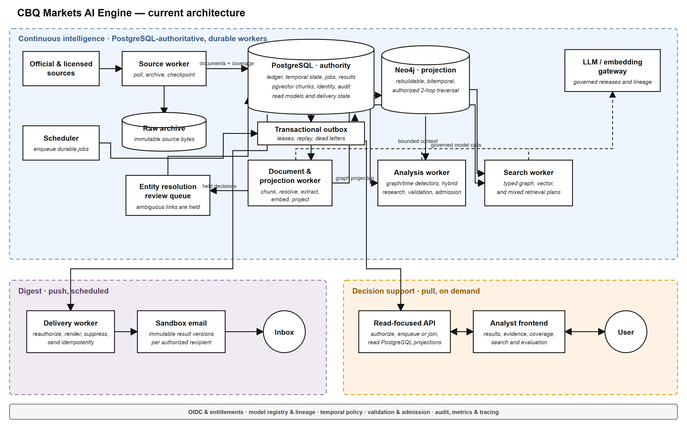

# CBQ Markets AI Engine — Current Architecture

## Purpose and authority

This document explains the current architecture diagram in this folder and why this design is a
better fit for the existing `fi-intel` system than the earlier Airflow-oriented services diagram.



The editable and scalable versions are:

- [`cbq_ai_engine_current_architecture.drawio`](./cbq_ai_engine_current_architecture.drawio)
- [`cbq_ai_engine_current_architecture.svg`](./cbq_ai_engine_current_architecture.svg)
- [`cbq_ai_engine_current_architecture.png`](./cbq_ai_engine_current_architecture.png)

This is a companion explanation, not a second architecture authority. The normative architecture,
readiness decisions, implementation status, and roadmap remain in
[`docs/DEV_MVP_READINESS_GAPS.md`](../docs/DEV_MVP_READINESS_GAPS.md).

## Executive summary

The current system is a **PostgreSQL-authoritative, graph-guided hybrid RAG architecture**. It is a
modular monolith deployed as independently restartable processes rather than a collection of
independently owned network microservices.

The main design rule is:

> PostgreSQL preserves authoritative truth; durable workers transform it; pgvector supplies
> semantic recall; Neo4j supplies bounded graph context; governed models explain the evidence; and
> the API and email layers expose only validated, immutable results.

The architecture supports two related products:

1. **Scheduled push:** continuously process evidence, run governed daily opportunity analysis, and
   deliver an authorized digest.
2. **On-demand pull:** allow an analyst to request analysis or search, inspect evidence, and record
   an evaluation through the web application.

Both products use the same authoritative documents, entities, assertions, authorization rules,
model releases, and immutable result identities.

## Start here: a human mental model

This system is easier to understand if you imagine a careful financial-newsroom operation rather
than one large piece of “AI.”

The newsroom receives announcements and market information all day. It keeps the original
documents in an evidence room, records what happened in an official case ledger, asks specialist
researchers to connect the facts, sends uncertain names to a review desk, and lets an editor publish
only claims that can be traced back to evidence. The website is the reception desk where analysts
ask questions. The email process is the controlled mailroom that sends approved reports.

The software blocks map to that newsroom as follows:

| Architecture block | Human equivalent | Why it exists |
|---|---|---|
| Official sources | Reporters and official notices | Bring new information into the newsroom. |
| Source worker | Intake clerk | Collects material consistently and records whether expected sources arrived. |
| Raw archive | Locked evidence room | Keeps the original document exactly as received. |
| PostgreSQL | Official case ledger | Holds the accepted history and the current state of every case. |
| Transactional outbox | Registered internal mail tray | Guarantees that committed work reaches the next specialist. |
| Document/projection worker | Research assistant | Reads, chunks, classifies, links, and indexes incoming material. |
| Entity-review queue | Name-checking desk | Stops “ABC Bank” from being attached to the wrong legal entity. |
| Neo4j | Relationship board on the wall | Makes ownership, issuance, maturity, rating, and event connections easy to follow. |
| Analysis worker | Senior financial analyst | Finds potentially useful situations and researches the evidence around them. |
| Search worker | Reference librarian | Answers a specific analyst question using the most appropriate search route. |
| Model gateway | AI research assistant | Helps extract, rank, and explain, but works within a controlled brief. |
| Validation/admission | Editor and compliance check | Rejects unsupported, unsafe, stale, or incorrectly authorized claims. |
| API | Reception desk | Accepts requests and returns approved information without doing research at the desk. |
| Frontend | Analyst workbench | Presents results, sources, uncertainty, and feedback controls. |
| Delivery worker | Controlled mailroom | Sends the right approved report to the right authorized recipient once. |

This analogy is intentionally simple, but it captures the most important design choice: **the AI is
one specialist in a controlled operation; it is not the owner of the evidence, the rules, or the
final decision to publish.**

## What happens to one real-world announcement

Consider an illustrative example: a bank publishes an official announcement about a bond maturity,
and the system is watching for upcoming refinancing needs.

### Step 1: collect the announcement

The source worker notices the new item. Before interpreting anything, it saves the exact original
bytes in the raw archive. It then records a document version, content hash, source, publication
time, retrieval time, and coverage observation in PostgreSQL.

Why save the original first? Because the source page may later change or disappear. Months later,
the team must still be able to prove exactly what the system saw.

### Step 2: reliably request processing

The document record and an outbox event are committed together. The database cannot contain a new
document while quietly forgetting to request processing for it.

If the document worker is offline, the event waits. If the worker crashes halfway through, its
lease expires and the work can be reclaimed. The announcement is delayed, not lost.

### Step 3: understand and index the document

The document/projection worker divides the document into meaningful chunks, creates embeddings,
locates entity mentions, and extracts candidate facts such as the issuer, instrument, currency,
amount, maturity date, and announcement status.

The original text and its coordinates remain attached to every candidate fact. The system does not
store only a model-generated summary and throw away the evidence.

### Step 4: confirm the correct legal entity

Suppose the announcement says “ABC Bank,” while the reference universe contains ABC Bank Q.P.S.C.,
an ABC holding company, and a similarly named foreign branch. Exact identifiers and strong context
may resolve it automatically. If the match is not sufficiently clear, the mention is held in the
entity-review queue.

Holding the item is better than confidently creating a refinancing opportunity for the wrong bank.

### Step 5: commit accepted intelligence

Accepted evidence and assertions enter PostgreSQL with their business-effective time and their
system-recorded time. A projection event then updates Neo4j with the corresponding relationships.

PostgreSQL remains the official record. Neo4j is the convenient relationship view built from that
record.

### Step 6: detect and research a possible opportunity

At the daily cutoff, the analysis worker verifies that required sources and processing are
complete. A detector may find that the bond is approaching maturity and that no qualifying
refinancing has yet been observed within the permitted evidence window.

The system then searches for both support and contradiction. It looks for refinancing, repayment,
cancellation, amendment, newer maturity information, and other evidence that could invalidate the
initial pattern. Neo4j supplies bounded relationship context; pgvector and lexical search supply
narrative evidence.

### Step 7: ask the model for a bounded explanation

The reasoning model receives a controlled evidence bundle. Its job is to explain the potential
opportunity using only that bundle and to attach citations. It cannot browse arbitrary sources,
write SQL or Cypher, change authorization, or decide that incomplete coverage means “nothing
happened.”

### Step 8: validate before publication

Deterministic and semantic checks verify that factual claims are supported, citations point to
immutable source text, dates and entities are consistent, the result is authorized, and material
state genuinely changed.

If validation fails, the result is held. A fluent paragraph is not enough to earn publication.

### Step 9: publish once and reuse everywhere

The accepted result becomes an immutable result version. The webpage and the email use that same
version. They do not independently regenerate the analysis.

An analyst can therefore open an email item, see the same result on the page, inspect the same
evidence, and submit feedback against the exact version that was shown.

## The questions this design is trying to answer

The architecture is built around practical questions that arise in financial intelligence:

- What exactly did the source say, and can we prove it later?
- Did we attach the evidence to the correct legal entity?
- Was the fact true on the business date being analyzed, or was it revised later?
- Did every required source complete, or are we mistaking missing data for no activity?
- Is this genuinely new, or did we already show the same opportunity yesterday?
- What evidence supports the claim, and what evidence contradicts it?
- Which model, prompt, policy, index, and source versions influenced this result?
- Can work resume safely after a process crashes?
- Can a user see or receive this information under their current entitlement?
- Did the email contain exactly the result that appeared on the page?

If an architecture cannot answer these questions, it may produce impressive text but it is not yet
a dependable evidence-first decision-support system.

## Why this architecture is better for this system

“Better” here means better for the current repository, evidence-first financial intelligence, and
the developer-MVP requirements. It is not a claim that this topology is universally best for every
organization.

### 1. PostgreSQL is the single authoritative system of record

PostgreSQL owns source and document identities, entities, resolution decisions, evidence,
assertions, temporal state, signals, jobs, opportunities, immutable results, subscriptions,
authorization state, delivery state, evaluation state, model lineage, and audit events.

This prevents conflicting truth across multiple databases. pgvector is part of the same
PostgreSQL authority, while Neo4j is explicitly disposable and rebuildable.

### 2. Work survives process and host failures

Source changes, document-processing requests, analysis requests, searches, and deliveries are
represented by durable state. Transactional outbox events, leases, retries, handler checkpoints,
and dead letters allow a failed worker to resume without silently losing work.

An in-memory task or an HTTP request is never the only record that work needs to happen.

### 3. The API remains a safe request boundary

The API authenticates users, resolves authorization, appends allowed transitions, queues or joins
durable work, and reads PostgreSQL projections. It does not fetch sources, perform extraction, run
graph research, invoke long model workflows, or send email inside an HTTP request.

This keeps request latency bounded and avoids losing analytical work when a client disconnects or
an API process restarts.

### 4. Neo4j provides graph capability without owning business truth

Neo4j is useful for typed relationships, temporal neighborhoods, graph detectors, bounded paths,
and relationship explanations. It does not own the only copy of an assertion, signal,
opportunity, or result.

If the graph is deleted or corrupted, it can be rebuilt from stable PostgreSQL identities without
refetching sources, rerunning extraction models, or losing analyst state.

### 5. Hybrid retrieval balances precision and recall

Daily opportunity discovery starts with graph and temporal detectors because they are good at
multi-fact state, chronology, supersession, and carefully bounded absence conditions. Hybrid
lexical and vector retrieval then finds the best supporting and contradictory narrative evidence.

Interactive search can instead select entity-first, pattern-first, thematic, or mixed retrieval,
because a broad analyst question may not match a predefined detector.

### 6. Model behavior is governed and reproducible

Extraction, reasoning, embedding, reranking, and entailment are separate serving roles. Each role
uses an evaluated registered release with prompt/schema lineage, configuration identity, usage
records, and quality-gate state.

A generic model endpoint alone is not allowed to decide authorization, entity identity, temporal
truth, materiality thresholds, result admission, or delivery eligibility.

### 7. Web and email cannot produce different analytical claims

The page, API, and digest consume the same immutable result version. Email rendering is
deterministic and does not ask a model to rewrite the result independently.

This provides exact page/email identity and makes an exposed claim traceable to one result,
evidence bundle, model release, policy version, and analysis run.

### 8. Authorization is enforced at every sensitive boundary

Authorization is checked when retrieving evidence, entering or traversing the graph, reading a
result, creating a digest, and immediately before sending email. Public and private scopes do not
share incompatible identities or caches.

A recipient allowlist, subscription state, pause/unsubscribe state, suppression policy, and kill
switch provide additional delivery controls.

### 9. The design matches the implemented application

The repository already contains the scheduler and independently restartable source, projection,
analysis, search, delivery, and API entry points. PostgreSQL migrations, the outbox, graph
projection, governed model bundle, retrieval paths, and recovery commands implement these
boundaries.

Adopting a different orchestration authority would require rewriting working failure, retry,
identity, and recovery semantics rather than merely changing a deployment diagram.

## Architecture principles

The design follows these rules:

- **One source-to-result path:** synthetic fixtures and prototypes are test-only.
- **PostgreSQL-first writes:** authoritative changes and their outbox events commit together.
- **Rebuildable projections:** indexes and graph state can be reconstructed from authority.
- **Immutable evidence:** source bytes, document versions, evidence coordinates, and result versions
  are not silently overwritten.
- **Deterministic identity:** retries converge on the same job, event, opportunity, digest, and
  delivery identities.
- **Bounded model authority:** models retrieve and synthesize within typed, validated contracts.
- **Fail closed:** incomplete coverage, unknown model releases, invalid authorization, or uncertain
  temporal state cannot become a confident published absence claim.
- **Shared analytical product:** eligible users may share a governed run only when their topic,
  authorization scope, entity universe, policies, and business window are compatible.

## Design decisions explained in plain language

This section explains the major choices, including what problem each choice solves and what cost it
introduces.

### Decision 1: keep one official ledger

**The problem:** A system that writes some facts to PostgreSQL, other facts only to a graph, and
still others only to an AI index can end up with three different answers to “what is true?” A
partial failure makes the disagreement worse.

**The decision:** PostgreSQL is the authoritative record. pgvector belongs to that PostgreSQL data
plane. Neo4j and retrieval indexes are derived views.

**Why this is reasonable:** Financial intelligence needs traceability more than it needs every store
to behave as an equal source of truth. One ledger gives operators a clear place to inspect,
authorize, replay, and audit state.

**The tradeoff:** PostgreSQL carries a broad schema and must be designed carefully. Some data is
duplicated into Neo4j for efficient graph use. Projection code and rebuild procedures are required.

**The human analogy:** A company may use dashboards and spreadsheets, but the audited accounting
ledger remains the official record.

### Decision 2: save evidence before interpreting it

**The problem:** Web pages and feeds change. Parsers and models also change. If the system retains
only the extracted summary, nobody can later determine whether an error came from the source, the
parser, the model, or a later source revision.

**The decision:** Archive immutable source bytes first, then create versioned documents and derived
intelligence.

**Why this is reasonable:** Replay becomes honest. A new extractor can be tested against the exact
old input, and an auditor can inspect the source material behind a result.

**The tradeoff:** Immutable storage consumes more space and requires retention, licensing, and
access policies. That cost is intentional because evidence is part of the product.

**The human analogy:** A court keeps the original exhibit rather than only a witness's description
of it.

### Decision 3: commit the fact and the request for follow-up together

**The problem:** Imagine saving a document and then crashing one millisecond before sending a
message to process it. The database says the document exists, but no worker knows that it needs
attention. Reversing the order creates the opposite failure: a worker is asked to process a
document that never committed.

**The decision:** Store the authoritative change and a transactional outbox event in one PostgreSQL
transaction.

**Why this is reasonable:** Either both records commit or neither does. Delivery to downstream
workers can be retried safely after the transaction.

**The tradeoff:** The application must operate an outbox dispatcher, leases, checkpoints, and dead
letters. This is more code than directly calling the next function, but it makes the failure
boundary explicit.

**The human analogy:** A registered-mail log and the item being dispatched are recorded as one
controlled handoff, so the organization can see what is still waiting.

### Decision 4: use durable jobs instead of making the API own long work

**The problem:** Source fetching, graph retrieval, and model reasoning can take seconds or minutes.
HTTP clients disconnect, load balancers time out, and API processes restart. If the request owns the
only task, work and status can disappear.

**The decision:** The API creates or joins a durable job. A worker claims the job with a lease. The
API returns the job state and later reads the result.

**Why this is reasonable:** The user's browser is no longer a life-support machine for the
analysis. Multiple identical requests converge on one deterministic job instead of paying for the
same analysis repeatedly.

**The tradeoff:** The interface becomes asynchronous. The frontend must present queued, running,
held, complete, and failed states rather than pretending every action completes immediately.

**The human analogy:** A reception desk issues a case number and sends work to the specialist team;
it does not make the visitor stand at the desk while the entire investigation happens.

### Decision 5: build a modular monolith with separate processes

**The problem:** One giant process has a large failure radius, but turning every internal function
into a microservice adds network calls, deployment units, credentials, version negotiations, and
distributed failure modes.

**The decision:** Keep one codebase and one application model, while running the API, scheduler,
source, projection, analysis, search, and delivery responsibilities as independently restartable
processes.

**Why this is reasonable:** The system gets operational isolation where it matters without paying
the full organizational and technical cost of microservices. Shared types and policies remain
consistent.

**The tradeoff:** Processes still share a deployment artifact and database schema. This is not the
right structure if different teams must independently release the components or if one component
needs radically different scaling.

**When to reconsider:** Split a component into a network service when independent ownership,
security isolation, release cadence, or measured scaling needs justify the boundary—not merely
because a box exists in a diagram.

### Decision 6: make the graph a rebuildable projection

**The problem:** Graph databases are excellent for relationship questions, but making the graph the
only owner of business facts makes audit, cross-store transactions, authorization, and recovery
harder.

**The decision:** PostgreSQL owns stable identities and temporal facts. Neo4j projects the
relationships needed for graph detection and traversal.

**Why this is reasonable:** A graph failure delays graph-dependent work but cannot erase the
official evidence or make unfinished work appear complete. Operators can rebuild and compare the
projection.

**The tradeoff:** Data is duplicated and projection lag must be monitored. Analysis that requires
the graph must wait for the relevant projection checkpoint.

**The human analogy:** The relationship board in an investigation room is extremely useful, but the
official case files remain in the records system. If the board falls down, it can be reconstructed.

### Decision 7: use graph-first discovery and routed interactive search

**The problem:** One retrieval strategy is not best for every question. Vector search is good at
finding semantically related writing but weak at proving a multi-step temporal condition or the
absence of a qualifying event. Graph patterns are precise but may miss useful narrative evidence.

**The decision:** Daily discovery begins with registered graph and temporal detectors, then gathers
hybrid evidence. Interactive search chooses entity, pattern, thematic, or mixed routes based on the
question.

**Why this is reasonable:** Daily email needs high precision and novelty, while interactive search
needs broader recall and flexibility. The product modes have different error costs.

**The tradeoff:** The system must implement and evaluate several retrieval components separately.
Route selection, fusion, and graph-entry metadata add complexity.

**The human analogy:** A fraud investigation may start from a known relationship pattern, while a
research librarian answering “what are banks saying about liquidity?” starts from broad textual
search. Forcing both to use the same first step would be unnatural.

### Decision 8: search explicitly for contradiction

**The problem:** A retrieval system naturally finds material similar to the initial idea. That can
create confirmation bias: a maturity announcement is found, while a later refinancing or
cancellation is missed.

**The decision:** Run separate searches for support and for withdrawal, correction, supersession,
repayment, refinancing, denial, and other falsifying evidence.

**Why this is reasonable:** A useful financial-intelligence result should survive an attempt to
disprove it, not merely collect sentences that agree with it.

**The tradeoff:** Contradiction retrieval costs additional queries and model capacity and may return
irrelevant negative language. It therefore needs pattern-specific queries and reranking.

**The human analogy:** A responsible analyst asks “what would prove me wrong?” before sending a
recommendation.

### Decision 9: limit graph traversal to typed, bounded plans

**The problem:** Allowing a model to generate arbitrary Cypher can create security exposure,
unpredictable cost, high-degree explosions, hard-to-reproduce results, and traversal across
unauthorized data.

**The decision:** The model can select only from an allowlisted plan schema. Relationship types are
known, time is pinned, identities are authorized, and traversal is capped at two hops for the MVP.

**Why this is reasonable:** Most useful entity and event context for this bounded product can be
expressed through known relationship patterns. Predictable limits protect both quality and
operations.

**The tradeoff:** Some legitimate complex questions cannot be answered in a single traversal. They
must be decomposed into typed steps or deferred.

**The human analogy:** A junior researcher receives access to approved case folders and a specific
search brief, not the master key to every records room.

### Decision 10: give the model a narrow job, not final authority

**The problem:** Language models are useful but can fabricate details, confuse similar entities,
follow instructions embedded in source text, produce malformed output, or state uncertain facts
fluently.

**The decision:** Models extract structured candidates, choose among allowed research actions,
rerank evidence, synthesize bounded explanations, and verify semantic support. Deterministic code
owns authorization, coverage, identity thresholds, temporal state, materiality, admission, and
delivery.

**Why this is reasonable:** The model is used where language understanding adds value, while rules
that must be consistent and auditable remain explicit.

**The tradeoff:** More validation code and schemas are required. The application may abstain even
when a human could infer the answer, because the supplied evidence or confidence is insufficient.

**The human analogy:** An AI assistant can draft the memo, but an editor checks the facts and a
compliance officer decides whether it may be distributed.

### Decision 11: preserve two kinds of time

**The problem:** “When did this happen?” and “when did we learn it?” are different questions. A
rating action may be effective on Monday but ingested on Wednesday. A correction published later
may change the understanding of an earlier event.

**The decision:** Preserve valid time and recorded time, along with publication, retrieval,
analysis, first-seen, and last-confirmed timestamps where relevant.

**Why this is reasonable:** Historical replay can use only information that was available at the
chosen cutoff, while current analysis can apply later corrections appropriately.

**The tradeoff:** Queries and lifecycle logic are harder than maintaining one `updated_at` column.
Tests must cover late, future-effective, revised, and superseded facts.

**The human analogy:** A newspaper correction has both a date for the original event and a later
date when the newsroom learned the original report was wrong.

### Decision 12: treat incomplete coverage as an unknown, not “nothing new”

**The problem:** If an expected source fails, the database may contain no new document. A naive
system interprets that silence as no market activity and sends a reassuring but unsupported result.

**The decision:** A daily manifest records required sources and processing checkpoints. “Nothing
new” is allowed only after all required coverage and processing are complete.

**Why this is reasonable:** In decision support, an honest “we do not know yet” is safer than a
false absence claim.

**The tradeoff:** The product may delay or hold a digest during an outage, which can feel less
responsive. The visible limitation is the correct product behavior.

**The human analogy:** A security guard cannot report “the building is clear” if one floor was
never inspected.

### Decision 13: hold ambiguous entities instead of forcing a match

**The problem:** Financial groups contain parents, subsidiaries, branches, issuers, instruments,
and similarly named institutions. A plausible string match can put correct evidence on the wrong
legal entity.

**The decision:** Automatic linking requires conservative evidence and a sufficient winner margin.
Ambiguous mentions enter a durable review state with provenance.

**Why this is reasonable:** A missed opportunity can be reviewed later; a confidently published
opportunity about the wrong institution can damage trust immediately.

**The tradeoff:** Conservative resolution lowers automatic coverage and creates human review work.
That is an intentional precision-versus-recall choice for admitted results.

**The human analogy:** A payment operations team pauses a transfer when two customers have nearly
identical names rather than guessing which account was intended.

### Decision 14: publish immutable result versions

**The problem:** If an analytical result is edited in place, the email, webpage, analyst feedback,
and audit history may refer to different wording and evidence while sharing the same identifier.

**The decision:** Material changes create a new immutable result version. A stable logical
opportunity identity connects new, updated, unchanged, contradicted, resolved, suppressed, or held
states over time.

**Why this is reasonable:** Every exposure and evaluation can identify exactly what the analyst
saw. Page and email remain consistent.

**The tradeoff:** Storage and queries must handle version history. Corrections append new state
rather than simply overwriting a row.

**The human analogy:** A published research report receives a new revision; the original distributed
version remains part of the record.

### Decision 15: analyze once per compatible scope, not once per recipient

**The problem:** Running the same expensive analysis independently for every subscriber wastes
capacity and can produce slightly different prose for people who should share the same governed
product.

**The decision:** Eligible subscribers share a daily run when topic, authorization scope, entity
universe, business window, and policy versions are compatible. Delivery preferences remain
recipient-specific.

**Why this is reasonable:** Shared immutable results improve consistency, reproducibility, and
cost. Authorization scope prevents unsafe sharing across incompatible audiences.

**The tradeoff:** The run identity and scope rules are more involved than simply using a recipient
ID. Users with genuinely different scopes require separate runs.

**The human analogy:** A research desk publishes one approved report to an entitled group, while the
mailroom handles each person's delivery preference.

### Decision 16: reauthorize immediately before delivery

**The problem:** A user may unsubscribe or lose access after a digest is assembled but before it is
sent. Checking authorization only at the start leaves a race window.

**The decision:** Recheck identity, entitlement, subscription, preference, suppression, allowlist,
and kill switch immediately before provider acceptance.

**Why this is reasonable:** The send decision uses the freshest available access state.

**The tradeoff:** Delivery performs additional database work and may suppress an already assembled
digest. That is preferable to unauthorized disclosure.

**The human analogy:** A courier verifies the recipient's current clearance at the secure door, not
only when the envelope was packed earlier in the day.

### Decision 17: make delivery idempotent and acknowledge uncertainty

**The problem:** Email providers may accept a message just before the worker crashes. On restart,
the application may not know whether the message was sent. Blind retry can create duplicates;
blind success can hide a failed delivery.

**The decision:** Use durable delivery identities and transitions. If acceptance is uncertain,
record `acceptance_unknown` and require investigation instead of automatically resending.

**Why this is reasonable:** The system states what it knows rather than inventing certainty.

**The tradeoff:** Some uncertain deliveries require operator attention and may not be retried
automatically.

**The human analogy:** If a signed package handoff was interrupted before the receipt returned, the
mailroom investigates rather than immediately sending a second confidential package.

### Decision 18: keep one governed runtime path and one operator configuration

**The problem:** Parallel prototype and production-like commands drift. One path may use fixtures,
skip authorization, or call an unregistered model while another path follows the real rules.

**The decision:** Expose one governed source-to-result runtime. Keep synthetic fixtures test-only
and use one operator-owned environment file with validated settings.

**Why this is reasonable:** A developer demonstration exercises the same architectural boundaries
that the application is expected to operate.

**The tradeoff:** Quick experiments cannot silently bypass required dependencies. Developers must
configure the real local infrastructure or explicitly work inside tests.

**The human analogy:** A fire drill should use the actual exits and procedures, not a shortcut that
exists only for the demonstration.

### Decision 19: observe the system without leaking sensitive data

**The problem:** Operators need enough telemetry to diagnose missing sources, stuck jobs, model
failures, retrieval weakness, and delivery problems. Logging raw private content, tokens, prompts,
or recipient addresses creates a new security risk.

**The decision:** Record structured identifiers, states, counts, durations, safe error categories,
lineage, and correlations while excluding secrets and unnecessary content.

**Why this is reasonable:** The team can answer “where did this run stop?” without turning logs into
an uncontrolled copy of sensitive evidence.

**The tradeoff:** Some debugging requires authorized inspection of the underlying records rather
than reading one verbose log message.

**The human analogy:** A hospital operations dashboard can show that a case is delayed at a stage
without displaying the patient's full medical record on the wall.

## Block-by-block explanation

### Continuous intelligence plane

#### Official and licensed sources

These are approved regulatory, government, company, market, and reference-data sources. Every
source has bounded coverage, cadence, origin policy, freshness expectations, and operational
state. The system does not claim complete GCC financial-institution coverage from the presence of
a small development source catalog.

#### Source worker

The source worker:

- polls registered sources at their configured cadence;
- follows origin and redirect allowlists;
- respects cursors, conditional requests, limits, and retry policy;
- archives original bytes before downstream interpretation;
- creates immutable raw-asset and document-version records;
- records freshness, completeness, and failure state; and
- emits deterministic outbox events in the same authoritative transaction.

It runs independently from the API and daily analysis, so new evidence can enter the system even
when analyst-facing processes are stopped.

#### Raw archive

The raw archive holds immutable source bytes using content-addressed identities. PostgreSQL owns
the corresponding identifiers, hashes, provenance, policy, and lineage.

The development deployment uses a mounted filesystem. The interface can later be backed by an
S3-compatible object store without changing the authoritative identity chain.

The archive enables exact audit and replay. Reprocessing uses previously captured bytes rather
than silently fetching a newer version of the source.

#### Scheduler

The scheduler calculates due work and inserts or joins durable jobs in PostgreSQL. It does not own
the analytical execution itself.

Examples include source polling, daily analysis windows, projection work, and due delivery work.
Deterministic business-window identities prevent duplicate runs when the scheduler is restarted or
invoked more than once.

#### PostgreSQL and pgvector — authoritative store

PostgreSQL owns:

- source registry, coverage policies, observations, and watermarks;
- raw-asset identities and archive pointers;
- document identities, immutable versions, duplicates, and quarantine state;
- chunks, embeddings, lexical indexes, pgvector indexes, and index versions;
- entity identities, aliases, parents, resolution decisions, and review state;
- evidence spans, claim candidates, assertions, and bitemporal state;
- signal identities and lifecycle transitions;
- analysis and search jobs, trajectories, leases, and transitions;
- logical opportunities and immutable result versions;
- daily-topic read models, exposures, evaluations, and outcomes;
- subscriptions, notification preferences, encrypted destinations, and suppression state;
- digest identities, items, delivery attempts, and delivery transitions;
- model releases, routing state, call outcomes, and lineage;
- authorization assignments and safe access events; and
- transactional outbox events, handler checkpoints, retries, and dead letters.

pgvector is used for semantic retrieval, but vector similarity is never treated as authoritative
fact or as the only daily opportunity detector.

#### Transactional outbox

The outbox bridges committed authoritative changes to asynchronous handlers.

A business transaction writes both:

1. the authoritative domain change; and
2. a deterministic event describing required downstream work.

Workers claim events with durable leases. Processing is idempotent by event identity and aggregate
version. Failed work is retried with bounded policy or moved to a visible dead-letter state.
Ordered aggregate handling prevents a later transition from overtaking an earlier unpublished
transition.

#### Document and projection worker

This independently restartable process consumes document and projection work. Its responsibilities
include:

- loading immutable archived source bytes;
- canonicalizing and structurally chunking documents;
- creating governed embeddings and retrieval metadata;
- resolving entity mentions;
- extracting structured evidence and candidate assertions;
- validating and admitting acceptable assertions to PostgreSQL;
- emitting deterministic graph-projection events; and
- projecting accepted identities and temporal state into Neo4j.

Ambiguous or invalid work is held or quarantined rather than being silently forced through the
pipeline.

#### Entity-resolution review queue

Automatic entity linking uses identifiers, aliases, jurisdiction, sector, parent relationships,
confidence thresholds, and winner margins. A weak or ambiguous match is placed in a durable review
queue.

The queue preserves the original mention, candidate, confidence, reason, source, and document
identity. A reviewed decision appends provenance to PostgreSQL; it does not erase the earlier
uncertainty.

This boundary is critical because evidence attached to the wrong legal entity can create a
convincing but false opportunity.

#### Neo4j — rebuildable projection

Neo4j contains only graph projections derived from PostgreSQL, including:

- typed entity relationships;
- current and as-of assertion neighborhoods;
- registered detector patterns;
- bounded multi-hop paths;
- timelines and time series;
- signal and precedent context; and
- relationship explanations.

Graph queries are typed, authorized, temporally pinned, relationship-allowlisted, and capped at two
hops for the MVP. Models cannot emit arbitrary Cypher.

Every graph object that influences a result carries stable PostgreSQL identities. Graph hits are
reauthorized and resolved back to authoritative PostgreSQL records before publication.

#### Analysis worker

The analysis worker claims one durable daily business-window job and then:

1. freezes the source, entity, model, policy, index, and temporal manifest;
2. verifies operational and factual coverage;
3. runs registered graph and temporal detectors;
4. retrieves supporting evidence using lexical and vector recall;
5. retrieves contradictory, corrective, and superseding evidence explicitly;
6. adds bounded authorized graph context;
7. fuses, deduplicates, diversifies, and reranks the evidence;
8. asks the governed reasoning model to synthesize only from that evidence;
9. validates citations, entailment, temporal correctness, and policy constraints;
10. updates logical opportunity lifecycle state; and
11. admits a new immutable result version only when material state has changed.

Incomplete required coverage produces a held or incomplete state, not a false “nothing new”
result.

#### Search worker

The search worker processes durable analyst-search jobs. A validated typed plan chooses one of four
routes:

- **Entity:** begin from a known legal entity and its authorized graph/evidence neighborhood.
- **Pattern:** begin from a registered graph or temporal pattern.
- **Thematic:** begin with lexical/vector recall for a broad narrative question.
- **Mixed:** run appropriate vector and graph seeds in parallel, then combine them.

Retrieved chunk metadata supplies exact entity, assertion, evidence, and document identifiers for
graph entry. Traversal is bounded and all graph identities are rechecked against PostgreSQL.

Search answers remain separate from admitted daily opportunities. A useful ad-hoc answer cannot
bypass daily-product coverage, novelty, lifecycle, and publication controls.

#### LLM and embedding gateway

The gateway is the transport boundary for the configured model endpoints. The application defines
five governed roles:

- structured extraction;
- analytical reasoning;
- embedding;
- reranking; and
- semantic entailment verification.

Before serving a role, the application checks the model registry, active release, artifact digest,
evaluation state, prompt version, schema version, and configuration identity. Model-call outcomes
and safe usage metadata are recorded durably.

The gateway may provide enterprise routing, authentication, capacity control, or endpoint
abstraction. It does not replace application-level authorization, release governance, validation,
or lineage.

### Digest — scheduled push

#### Delivery worker

The delivery worker selects due authorized recipients and assembles a digest from already admitted
immutable result versions. Immediately before provider acceptance it rechecks:

- current identity and entitlement;
- topic subscription;
- recipient allowlist;
- timezone and notification preference;
- pause or unsubscribe state;
- suppression policy and kill switch; and
- result authorization scope.

Rendering is deterministic and escaped. A durable idempotency key prevents duplicate sends across
restarts and retries. If the process dies during the provider-acceptance window, the attempt becomes
`acceptance_unknown` and is not automatically resent.

#### Sandbox email provider

The development provider receives deterministic HTML and text produced from immutable results.
Model-authored prose is not regenerated for email.

The developer MVP uses sandbox delivery and an explicit recipient allowlist. Unrestricted customer
delivery, reputation management, bounce processing, and production records-management controls are
deferred beyond this architecture stage.

#### Inbox

The inbox represents the authorized recipient. Email items reference the same result versions that
the API and page expose. Coverage warnings and lifecycle state remain visible, and sensitive
content can be rendered link-only when required.

### Decision support — on-demand pull

#### Read-focused API

The API:

- validates OIDC access tokens;
- resolves current server-owned roles, desks, purposes, sides, and entitlement groups;
- reads topics, subscriptions, run state, results, evidence, searches, and evaluations;
- appends allowed subscription and evaluation transitions;
- inserts or joins deterministic daily-analysis and search jobs; and
- returns queued/running/current/nothing-new/incomplete/failed states accurately.

It never owns polling, extraction, projection, research, or delivery. Incomplete work returns a
durable job identity instead of being hidden behind a long synchronous request.

#### Analyst frontend

The frontend provides the Stage One analyst workflow:

- authenticate with a development OIDC token;
- choose and subscribe to governed topics;
- enqueue or join the current daily analysis;
- distinguish queued, running, current, nothing-new, incomplete, and failed states;
- inspect opportunity, lifecycle, materiality, and freshness information;
- expand supporting and contradictory evidence;
- inspect unknowns, falsifiers, temporal state, coverage, and investigation trace;
- submit exposure-bound evaluations; and
- run and inspect governed interactive searches.

The frontend does not receive direct database or graph credentials. All reads and transitions pass
through the API authorization boundary.

#### User

The user represents an authenticated analyst. Access is based on current server-owned attributes,
not on claims accepted blindly from the browser. The browser holds a pasted development token only
in session storage for the current developer workflow.

## Cross-cutting controls

### OIDC and entitlements

Identity and access rules apply to source scope, retrieval, graph entry, traversal, results, page
reads, digest construction, and delivery. Authorization is recalculated at sensitive boundaries so
previous access does not remain valid after an entitlement change.

### Model registry and lineage

Every governed model role resolves to an evaluated release. Results retain the model, artifact,
prompt, schema, policy, preprocessing, and tool-contract lineage needed for audit and replay.

### Temporal policy

The system distinguishes:

- when a fact is valid in the business world;
- when the system recorded it;
- future-effective state;
- revised, withdrawn, completed, or superseded state; and
- late-arriving evidence.

Daily jobs use a frozen temporal pin so later evidence cannot silently change a historical run.

### Validation and admission

Model responses must match strict schemas. Factual claims must cite immutable evidence coordinates
and pass deterministic or semantic support checks. Authorization, coverage, entity identity,
temporal truth, materiality, and delivery eligibility remain deterministic policy decisions.

### Audit, metrics, and tracing

Safe telemetry covers source freshness, queue lag, leases, resolution decisions, extraction
rejection, projection lag, detector coverage, retrieval ranks, graph bounds, model calls,
admission decisions, lifecycle changes, and delivery transitions.

Credentials, tokens, private raw content, complete prompts, and recipient destinations are not
written to normal logs.

## End-to-end flows

### Continuous ingestion and projection

```text
approved source
  -> source worker
  -> immutable raw archive
  -> PostgreSQL document version + coverage state + outbox event
  -> document/projection worker
  -> chunks + embeddings + entity decisions + evidence + assertions in PostgreSQL
  -> deterministic projection event
  -> rebuildable Neo4j graph state
```

### Daily opportunity analysis

```text
scheduler or authorized API request
  -> deterministic PostgreSQL analysis job
  -> analysis worker lease
  -> frozen input manifest and temporal pin
  -> coverage check
  -> graph/time detector candidates
  -> support + contradiction + bounded graph retrieval
  -> fusion + reranking + governed synthesis
  -> citation, entailment, temporal, authorization and policy validation
  -> logical opportunity transition + immutable result version
  -> PostgreSQL daily read model
```

### Interactive search

```text
user -> frontend -> API
  -> durable typed search job in PostgreSQL
  -> search worker
  -> entity, pattern, thematic or mixed retrieval
  -> authorized vector-to-graph entry and bounded expansion
  -> PostgreSQL authority lookup
  -> support/contradiction retrieval + governed synthesis
  -> durable answer and citations
  -> API -> frontend -> user
```

### Scheduled digest delivery

```text
admitted immutable result versions
  -> due-recipient selection
  -> immediate authorization/preference/suppression recheck
  -> deterministic digest and delivery identity
  -> escaped HTML/text rendering
  -> sandbox email provider
  -> authorized inbox
```

## Authoritative identity chain

The core evidence-to-feedback chain is:

```text
raw_asset_id
  -> document_version_id
  -> entity_id
  -> evidence_span_id / assertion_id
  -> signal_id
  -> investigation_id
  -> logical_opportunity_id
  -> result_version_id
  -> exposure_id
  -> evaluation_id
```

Digest and delivery identities branch from immutable result versions. Stable identity is derived
from business inputs and governed policy/artifact lineage, not database insertion order or
model-authored wording alone.

## Failure and recovery behavior

| Failure | Expected behavior |
|---|---|
| Source unavailable | Record incomplete coverage; retry according to source policy; do not publish a false absence claim. |
| Invalid or malformed document | Quarantine visibly while retaining the raw bytes and failure reason. |
| Ambiguous entity | Hold the mention in the resolution queue; do not attach it confidently to a legal entity. |
| Model timeout or malformed output | Record the call outcome; retry or hold according to bounded policy; do not admit invalid output. |
| Worker crash | Lease expires and another worker resumes the durable job or event. |
| Outbox handler repeatedly fails | Move the event to a visible dead-letter state with operator replay support. |
| Neo4j unavailable | Keep PostgreSQL authoritative; do not mark projection-dependent work complete. |
| Neo4j data loss | Rebuild the projection entirely from PostgreSQL and verify equivalent counts. |
| API restart or client disconnect | Durable analysis/search jobs continue independently. |
| Duplicate scheduler/API request | Join the deterministic existing business-window job. |
| Email worker crashes before send | Retry the same durable delivery identity. |
| Email worker crashes during provider acceptance | Record `acceptance_unknown`; do not automatically resend. |
| Entitlement or unsubscribe changes | Recheck immediately before delivery and suppress the send. |

## Comparison with the earlier Airflow-oriented diagram

| Area | Current architecture | Earlier services diagram |
|---|---|---|
| Orchestration authority | PostgreSQL durable jobs, outbox, leases, and worker checkpoints | Airflow DAGs, with analytical durability and ownership underspecified |
| API responsibility | Authenticate, authorize, enqueue/join, and read | Resolve, traverse, rank, and synthesize in the backend API |
| Authoritative data | Explicit PostgreSQL append-only authority | PostgreSQL shown, but authority and immutable lineage are not defined |
| Raw evidence | Immutable archive plus document versions and coordinates | Not shown |
| Graph | Rebuildable, authorized Neo4j projection | Graph nodes and edges placed in PostgreSQL without traversal/governance detail |
| Retrieval | Graph/time detection plus lexical, vector, contradiction, and reranking | Backend ranking and synthesis are summarized but not governed |
| Entity ambiguity | Durable resolution decisions and held review queue | Alias review is shown, but lifecycle/provenance are unspecified |
| Model governance | Five governed roles, evaluated releases, lineage, usage, and validation | Shared gateway with embedding/chat/reranker only |
| Result integrity | Immutable result version shared by page, API, and email | Digest and on-demand synthesis can become separate paths |
| Delivery | Per-recipient authorization, preferences, suppression, idempotency | “One text for everyone” risks incompatible authorization scopes |
| Recovery | Replay, stale-lease recovery, dead letters, archive replay, graph rebuild | DAG retry is implied but cross-store recovery is not defined |
| Security | OIDC, entitlement enforcement at every sensitive boundary, fail-closed policy | Authentication and trust boundaries are not shown |
| Fit with repository | Matches implemented processes, migrations, tests, and runbook | Requires a new orchestration platform and substantial redesign |

### Useful ideas retained from the earlier diagram

The earlier diagram still contributes useful presentation and boundary ideas:

- clearly separate scheduled push from on-demand pull;
- keep a visible expert entity-review queue;
- treat the model gateway as an external enterprise integration boundary; and
- show the user, frontend, API, email, and inbox explicitly.

Those ideas are included in the current diagram without moving analytical ownership into the API
or replacing durable application state with scheduler-only state.

### When Airflow could still be used

Airflow can be added as an enterprise scheduling or monitoring adapter if the organization requires
it. In that case it should enqueue or observe the same deterministic PostgreSQL jobs. It should not
become a second owner of document, analysis, search, opportunity, or delivery state.

Likewise, a shared entity-enrichment service can be used behind the existing resolution contract if
multiple products require it. PostgreSQL should still record the authoritative decision,
confidence, provenance, review state, and temporal history used by this application.

## Operational topology

The development deployment runs these independently restartable processes:

- API;
- scheduler;
- source worker;
- document/projection worker;
- analysis worker;
- search worker; and
- delivery worker.

They share PostgreSQL, while the processes that need graph context also use Neo4j. The delivery
worker connects to the sandbox mail provider. Model-backed processes connect to the configured
LLM/embedding endpoints through governed application adapters.

Process separation provides isolation and restartability without requiring a separate repository,
deployment unit, or network API for every internal stage.

## What this architecture does not claim

The current developer architecture does not by itself prove:

- complete or licensed GCC financial-institution source coverage;
- production statistical performance;
- named-analyst usefulness;
- full Arabic-language quality;
- unrestricted customer email readiness;
- production model-risk approval;
- penetration, compliance, or records-management approval;
- multi-region failover or disaster recovery; or
- production autoscaling and service-level objectives.

Those require external data, evaluation, operational, security, and governance qualification after
the developer MVP behaves correctly.

## Related implementation references

- Runtime and accepted decisions: [`docs/DEV_MVP_READINESS_GAPS.md`](../docs/DEV_MVP_READINESS_GAPS.md)
- Developer setup and recovery: [`README.md`](../README.md)
- Process topology: [`deploy/compose.yml`](../deploy/compose.yml)
- Canonical process entry points: [`fi_intel/cli.py`](../fi_intel/cli.py)
- Durable analysis jobs: [`fi_intel/application/jobs.py`](../fi_intel/application/jobs.py)
- Transactional outbox: [`fi_intel/application/outbox.py`](../fi_intel/application/outbox.py)
- Entity-resolution persistence: [`fi_intel/ingest/resolve_store.py`](../fi_intel/ingest/resolve_store.py)
- Governed model bundle: [`fi_intel/governance/serving.py`](../fi_intel/governance/serving.py)
- Architecture boundary tests: [`tests/test_architecture_boundaries.py`](../tests/test_architecture_boundaries.py)
